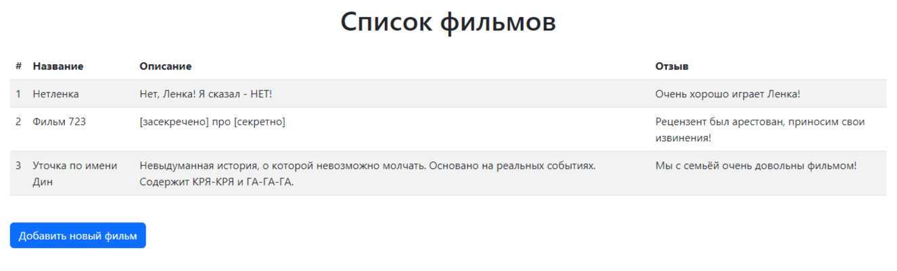
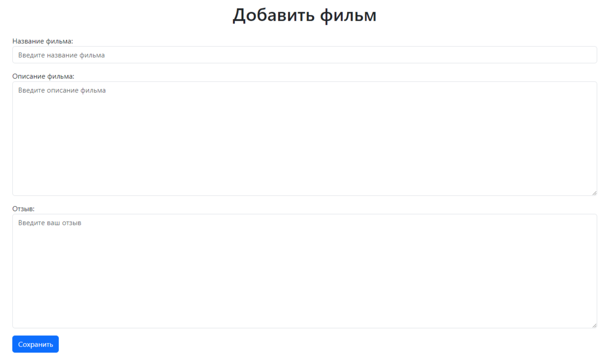

#### В данном репозитории содержится:
* проект Django с именем movie_project
* **Создано приложение films для работы с фильмами**
* **Создана модель Film с полями: название, описание и отзыв**
* **Созданы две html страницы:** 
  * film_list.html (список фильмов) http://127.0.0.1:8000/films/list/
  * add_film.html (добавление нового фильма) http://127.0.0.1:8000/films/add/
* **Создан базовый шаблон с общей структурой base.html**
  * Добавлена навигация 
  * Улучшен внешний вид таблицы и формы
###### (Для запуска проекта откройте терминал и выполните команду: python manage.py runserver)

